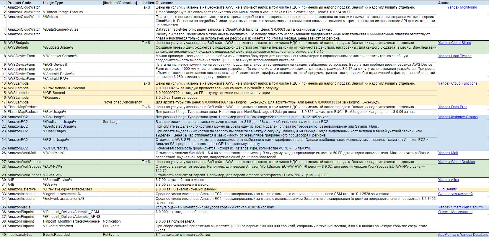

# Лабораторная работа №1 (AWS)

### Цель работы:

Знакомство с облачными сервисами. Понимание уровней абстракции над инфраструктурой в облаке. Формирование понимания типов потребления сервисов в сервисной-модели. Сопоставление сервисов между разными провайдерами. Оценка возможностей миграции на отечественные сервисы.

### Дано:

1. Слепок данных биллинга от провайдера после небольшой обработки в виде SQL-параметров. Символ % в начале/конце означает, что перед/после него может стоять любой набор символов.
2. Google с документациями провайдера

### Сопоставление сервисов и аналогов:
<table>
    <tr>
        <td><b>Название</b></td>
        <td><b>Описание</b></td>
        <td><b>Аналог</b></td>
        <td><b>Описание аналога</b></td>
    </tr>
    <tr>
        <td>AmazonCloudWatch</td>
        <td>Сервис, который отслеживает приложения, реагирует на изменения производительности, оптимизирует использование ресурсов и предоставляет аналитическую информацию о работоспособности системы.</td>
        <td><a href="https://cloud.yandex.ru/services/monitoring">Yandex Monitoring</a></td>
        <td>Сервис позволяет собирать, хранить и отображать метрики, а также настраивать алерты и присылать по ним уведомления.</td>
    </tr>
    <tr>
        <td>AWSBudgets</td>
        <td>С помощью этого сервиса можно отслеживать свои расходы, следить за прогнозируемыми расходами и использованием ресурсов, создавать пользовательские действия для предотвращения перерасхода и неэффективного использования ресурсов.</td>
        <td><a href="https://cloud.yandex.com/en/services/billing">Yandex Cloud Billing</a></td>
        <td>Предоставляет информацию об использовании сервиса, расходах и позволяет совершать платежи.</td>
    </tr>
    <tr>
        <td>AWSDeviceFarm</td>
        <td>Сервис для тестирования приложений, который позволяет повысить производительность мобильных и веб-приложений. Для этого используются различные браузеры для настольных компьютеров и реальные мобильные устройства.</td>
        <td><a href="https://cloud.yandex.ru/docs/load-testing/">Yandex Load Testing</a></td>
        <td>Yandex Load Testing позволяет проводить нагрузочное тестирование, чтобы анализировать производительность ваших сервисов и приложений.</td>
    </tr>
    <tr>
        <td>AWSLambda</td>
        <td>С помощью этого сервиса можно запускать программный код без необходимости выделять инфраструктуру или управлять ею, обеспечить автоматическое реагирование на запросы на выполнение кода в любом масштабе, сократить время выполнения кода и повысить производительность.</td>
        <td><a href="https://cloud.yandex.ru/services/functions">Yandex Cloud Functions</a></td>
        <td>Сервис позволяет запускать ваш код в виде функции в безопасном, отказоустойчивом и автоматически масштабируемом окружении без создания и обслуживания виртуальных машин.</td>
    </tr>
    <tr>
        <td>ElasticMapReduce (EMR)</td>
        <td>С помощью этого сервиса можно запускать приложения для работы с большими данными и анализировать петабайты данных, создавать приложения с использованием новейших платформ с открытым исходным кодом, легко выполнять разработку, визуализацию и отладку приложений.</td>
        <td><a href="https://cloud.yandex.ru/docs/data-proc/">Yandex Data Proc</a></td>
        <td>Сервис для обработки многотерабайтных массивов данных с использованием инструментов с открытым исходным кодом.</td>
    </tr>
    <tr>
        <td>AmazonEC2</td>
        <td>С помощью этого сервиса можно получить масштабирование ресурсов за несколько минут, обеспечить себя безопасными вычислениями для приложений, получить надежную систему безопасности, оптимизировать производительность, с легкостью осуществлять миграцию и разрабатывать приложения.</td>
        <td><a href="https://cloud.yandex.ru/docs/compute/concepts/instance-groups/">Yandex Instance Groups</a></td>
        <td>Это компонент сервиса Compute Cloud, который позволяет создавать группы виртуальных машин и управлять ими. Instance Groups автоматически идентифицирует и корректирует неработоспособные виртуальные машины в группе для обеспечения их оптимальной работы.</td>
    </tr>
    <tr>
        <td>AmazonWorkMail</td>
        <td>Это надежный управляемый сервис для деловой электронной почты и календарей с поддержкой существующих почтовых клиентов для настольных компьютеров и мобильных почтовых клиентов.</td>
        <td><a href="https://360.yandex.ru/mail/">Yandex Mail</a></td>
        <td>Это бесплатный, надежный и удобный сервис электронной почты со встроенным переводчиком и защитой от спама и вирусов.</td>
    </tr>
    <tr>
        <td>AmazonWorkSpaces</td>
        <td>Это полностью управляемые, безопасные и надежные решения виртуальных рабочих столов для любых рабочих нагрузок.</td>
        <td><a href="https://cloud.yandex.ru/services/cloud-desktop">Yandex Cloud Desktop</a></td>
        <td>Сервис для создания удалённых рабочих мест в облаке.</td>
    </tr>
    <tr>
        <td>A4B (Alexa for Business)</td>
        <td>Это сервис, благодаря которому организации и их сотрудники могут использовать Alexa, чтобы повысить эффективность работы.</td>
        <td><a href="https://yandex.ru/alice">Yandex Alice</a></td>
        <td>Это виртуальный голосовой помощник, который может управлять различными устройствами, отвечать на вопросы и выполнять задания. </td>
    </tr>
    <tr>
        <td>AmazonDetective</td>
        <td>С помощью этого сервиса можно определять потенциальные проблемы безопасности с помощью единого представления о взаимодействии пользователей и ресурсов, исследовать и реагировать на обнаруженные ошибки безопасности с помощью оптимизированных визуализаций.</td>
        <td><a href="https://bugbounty.ru/">Bug Bounty</a></td>
        <td>Это программа, в ходе которой компания привлекает сторонних специалистов по безопасности для тестирования своего программного обеспечения на уязвимости за вознаграждение или иные бенефиты.</td>
    </tr>
    <tr>
        <td>AmazonInspector</td>
        <td>Предоставляет собой автоматизированный сервис для управления уязвимостями, который постоянно проверяет рабочие нагрузки AWS на наличие уязвимостей в программном обеспечении и в сетевой среде.</td>
        <td><a href="https://cloud.yandex.ru/docs/container-registry/concepts/vulnerability-scanner">Сканер уязвимостей</a></td>
        <td>Cервис, который позволяет провести статический анализ Docker-образа на наличие уязвимостей в компонентах, библиотеках и зависимостях, которые используются в Docker-образе.</td>
    </tr>
    <tr>
        <td>AmazonMacie</td>
        <td>Это сервис, который обеспечивает безопасность и конфиденциальность, используя машинное обучение (ML) и сопоставление со специальными шаблонами для обнаружения и защиты конфиденциальных данных.</td>
        <td><a href="https://cloud.yandex.ru/services/smartwebsecurity">Yandex Smart Web Security</a></td>
        <td>Сервис для защиты веб-приложений. Защита от DDoS-атак на уровне приложений, защита от ботов, встроенный мониторинг и логирование.</td>
    </tr>
    <tr>
        <td>AmazonPinpoint</td>
        <td>Этот сервис предлагает маркетологам и разработчикам единый настраиваемый инструмент для обмена информацией с клиентами в рамках любых каналов, сегментов и кампаний.</td>
        <td><a href="https://360.yandex.ru/business/messenger/">Яндекс Мессенджер</a></td>
        <td>Это приложение для общения, в котором можно отправлять сообщения, обмениваться файлами, совершать звонки, использовать каналы.</td>
    </tr>
    <tr>
        <td>mobileanalytics</td>
        <td>Mobile Analytics — часть сервиса Amazon Pinpoint. Это сервис, который фокусируется на анализе использования мобильных приложений и вовлеченности.</td>
        <td><a href="https://cloud.yandex.ru/docs/tutorials/datalens/data-from-appmetrica-visualization">AppMetrica в Yandex DataLens</a></td>
        <td>Можно анализировать мобильные приложения с помощью визуализации и исследования AppMetrica при прямом подключении DataLens.</td>
    </tr>
</table>
При выполнении работы использовалась официальная документация AWS

### Итоговая таблица: 

### Вывод:
В ходе выполнения лабораторной работы были проанализированы AWS сервисы, а также подобраны для них российские аналоги. 
Из сопоставления можно сделать вывод, что для всех сервисов существуют полные или частичные аналоги на российском рынке.