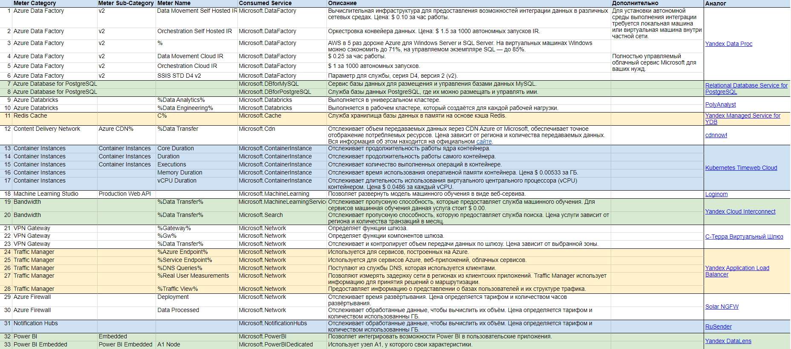

# Лабораторная работа №2 (Azure)

### Цель работы:

Знакомство с облачными сервисами. Понимание уровней абстракции над инфраструктурой в облаке. Формирование понимания типов потребления сервисов в сервисной-модели. Сопоставление сервисов между разными провайдерами. Оценка возможностей миграции на отечественные сервисы.

### Дано:

1. Слепок данных биллинга от провайдера после небольшой обработки в виде SQL-параметров. Символ % в начале/конце означает, что перед/после него может стоять любой набор символов.
2. Google с документациями провайдера

### Сопоставление сервисов и аналогов:
<table>
    <tr>
        <td><b>Название</b></td>
        <td><b>Описание</b></td>
        <td><b>Аналог</b></td>
        <td><b>Описание аналога</b></td>
    </tr>
    <tr>
        <td>Azure Data Factory</td>
        <td>Облачный сервис интеграции данных, который позволяет создавать в облаке управляемые данными рабочие процессы для организации и автоматизации перемещения и преобразования данных.</td>
        <td><a href="https://cloud.yandex.ru/docs/data-proc/">Yandex Data Proc</a></td>
        <td>Сервис помогает разворачивать кластеры Apache Hadoop® и Apache Spark™ в инфраструктуре Yandex Cloud. Вы сами определяете размер кластера, мощность узлов и набор сервисов Apache.</td>
    </tr>
    <tr>
        <td>Azure Database for PostgreSQL</td>
        <td>Облачная служба базы данных от Azure на основе данных PostgreSQL. Полностью управляемыя служба базы данных с предсказуемой производительностью, высокой доступностью и динамической масштабируемостью.</td>
        <td><a href="https://cloud.ru/ru/products/relational-databases-service-postgresql">Relational Database Service for PostgreSQL</a></td>
        <td>Система управления базами данных с открытым исходным кодом. Сервис позволяет настраивать и масштабировать реляционные базы данных, обеспечивает безопасность и предоставляет систему мониторинга производительности.</td>
    </tr>
    <tr>
        <td>Azure Databricks</td>
        <td>Единая, открытая платформа аналитики для создания, развертывания, совместного использования и обслуживания корпоративных данных, аналитики и решений искусственного интеллекта в масштабе. Платформа аналитики данных Databricks интегрируется с облачным хранилищем и безопасностью в облачной учетной записи, а также управляет и развертывает облачную инфраструктуру от вашего имени.</td>
        <td><a href="https://www.megaputer.com/polyanalyst/">PolyAnalyst</a></td>
        <td>Low-code платформа визуальной разработки сценариев анализа данных и текстовых документов, а также построения интерактивных отчётов, не требующая навыков программирования.</td>
    </tr>
    <tr>
        <td>Redis Cache</td>
        <td>Служба кэширования. Предоставляет хранилище данных в памяти на основе ПО Redis. Обеспечивает низкую задержку, высокую пропускную способность, высокую доступность, масштабируемость и безопасность.</td>
        <td><a href="https://cloud.yandex.ru/docs/ydb/">Yandex Managed Service for YDB</a></td>
        <td>Помогает разворачивать и поддерживать базы данных YDB в инфраструктуре Yandex Cloud.</td>
    </tr>
    <tr>
        <td>Content Delivery Network (CDN)</td>
        <td>Сетевая инфраструктура. Обеспечивает быструю доставку контента пользователям сайтов и веб-серверов за счёт географической распределённости серверов. Таким образом, уменьшаются задержки сети и зависания на сайтах (больше людей остаются на сайтах и радуются), снижается нагрузка на сервер источника (много CDN-серверов распределены по теорритории).</td>
        <td><a href="https://cdnnow.ru/">cdnnow!</a> </td>
        <td>Сервис передачи данных для неограниченного количества пользователей по всему миру с сохранением максимальной скорости загрузки независимо от места нахождения как источника контента, так и его потребителя. Серверы находятся в России, СНГ, Азии и США.</td>
    </tr>
    <tr>
        <td>Container Instances</td>
        <td>Служба для развертывания и запуска контейнерных приложений в Azure. Позволяет указывать характеристики, необходимые контейнеру и автоматически выделяют ресурсы длы него при развёртывании. Интегрируется с Azure Functions и Azure Monitor, поддерживает работу с оркестраторами: Docker, Kubernetes и Azure Batch. Полный список цен указан на официальном сайте.</td>
        <td><a href="https://timeweb.cloud/">Kubernetes Timeweb Cloud</a></td>
        <td>Служба для автоматического управления контейнерными приложениями, начиная с развёртывания контейнера и его масштабирования, заканчивая мониторингом и обработкой ошибок.</td>
    </tr>
    <tr>
        <td>Machine Learning Studio</td>
        <td>Облачная служба, которая позволяет создавать, обучать и раввёртывать модели анализа. Представляет набор инструментов и услуг для создания интеллектуальных приложения с использованием машинного обучения. Цена использования службы зависит от набора факторов, более полую информацию можно получить на официальном сайте.</td>
        <td><a href="https://loginom.ru/">Loginom</a></td>
        <td>Аналитическая low-code платформа, которая позволяет проводить анализ данных любого уровня сложности без программирования. В число возможностей программы входит также и машинное обучение.</td>
    </tr>
    <tr>
        <td>Bandwidth</td>
        <td>Служба, отвечающая за перемещение данных в датацентры Azure и из них, а так же и между датацентрами.</td>
        <td><a href="https://cloud.yandex.ru/docs/interconnect/">Yandex Cloud Interconnect</a></td>
        <td>Организация и контроль физического соединения между инфраструктурой клиента и облачными ресурсами в Yandex Cloud.</td>
    </tr>
    <tr>
        <td>VPN Gateway</td>
        <td>Тип шлюза виртуальной сети. Состоит из двух и более виртуальных машин под управлением Azure, которые автоматически настраиваются и разворачиваются в созданной подсети. Виртуальные машины запускают определённые службы шлюза. Цена услуги зависит от типа шлюза, который определяет пропускную способность.</td>
        <td><a href="https://sterra-vpn.ru/wp-content/uploads/2023/02/S-terra_Katalog_16-03-2023.pdf">С-Терра Виртуальный Шлюз</a></td>
        <td>Шлюз безопасности, функционирующий в виртуальной машине, созданной в одном из популярных гипервизоров (VMware, Citrix XenServer, Microsoft Hyper-V, KVM).</td>
    </tr>
    <tr>
        <td>Traffic Manager</td>
        <td>Сервис, который балансирует нагрузку на основе DNS, управляет распределением пользовательского трафика на эндпоинты службы в датацентре. Контролирует рапределение пользовательского трафика и работоспособностью эндпоинтов.</td>
        <td><a href="https://cloud.yandex.ru/services/application-load-balancer">Yandex Application Load Balancer</a></td>
        <td>Сервис для распределения входящего трафика между разными компонентами веб‑приложений.</td>
    </tr>
    <tr>
        <td>Azure Firewall</td>
        <td>Облачная служба для обеспечения безопасности сети с отслеживанием состояния и неограниченными возможностями масштабирования в облаке. Позволяет создавать, применять, регистрировать политики подключения для приложений и сетей в подписках и виртуальных сетях.</td>
        <td><a href="https://rt-solar.ru/products/solar_ngfw/">Solar NGFW</a></td>
        <td>Программный межсетевой экран нового поколения (NGFW). Обеспечивает комплексную защиту корпоративной сети от сетевых атак и вредоносного ПО, а также управление доступом к веб‑ресурсам</td>
    </tr>
    <tr>
        <td>Notification Hubs</td>
        <td>Служба для мобильных push-уведомлений на устройства с различными операционными системами. Уведомления можно отправлять конкретным пользователям или группам пользователей.</td>
        <td><a href="https://sendpulse-alternative.rusender.ru/">RuSender</a></td>
        <td>Развивающаяся компания для создания и отправки рассылок. пока в функционале присутствуют только почтовые рассылки.</td>
    </tr>
    <tr>
        <td>Power BI</td>
        <td>Платформа для бизнес-аналитики. Позволяет собирать и структурировать данные из разных источников, преобразовывать их в единый формат. Позволяет на основе данных создавать визуализации и объединять их в интерактивные отчёты.</td>
        <td rowspan="2"><a href="https://datalens.yandex.ru/">Yandex DataLens</a></td>
        <td rowspan="2">Сервис визуализации и анализа данных от Yandex Cloud.</td>
    </tr>
    <tr>
        <td>Power BI Embedded</td>
        <td>Тестовая площадка для аналитики. премиум версия Power BI.</td>
    </tr>
</table>

При выполнении работы использовалась официальная документация Azure 

### Итоговая таблица:

### Вывод:
В ходе выполнения лабораторной работы были проанализированы Azure сервисы, а также подобраны для них российские аналоги.
Из сопоставления можно сделать вывод, что для всех сервисов существуют полные или частичные аналоги на российском рынке.