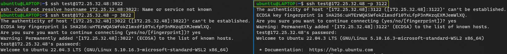
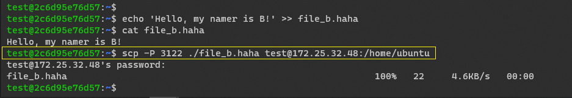
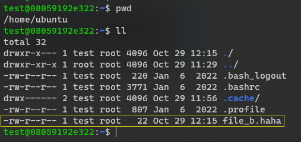
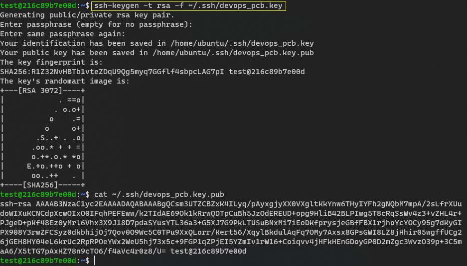

# Лабораторная работа №1

## Условие (без звездочки)
Пользуясь терминалом на компьютере А перенести файл с компьютера Б на компьютер С, находящиеся в одной локальной сети.

## Ход работы
1. Поднимаем два контейнера на портах 3022 и 3122 с ssh-серверами - это будут компьютеры Б и С
2. Подключаемся к Б и С с помощью команды `ssh *username*@*address*`

3. Создаем на компьютере Б файл `file_b.haha`
4. Отправляем файл на компьютер С с помощью команды `scp *file_name* *username*@*address*:*path*`

> scp - это утилита для копирования и безопасного перемещения файлов, которая работает по протоколу SSH

5. Проверяем, что на компьютере С появился переданный файл

## Условие (со звездочкой)
Сделать аналогичное, но подключаться при помощи публичных и приватных ключей.

## Ход работы
1. Генерируем пару RSA ключей с помощью команды `ssh-keygen -t rsa -f *path*` 

> ssh-keygen - утилита, используемая для генерации пары SSH ключей: публичного и приватного

2. Передаем сгенерированный ключ на компьютер С, используя команду `ssh-copy-id *file_name* *username@address*`

> ssh-copy-id - утилита для упрощенного копирования и передачи публичного ключа

3. Пробуем перенести файл `file.pcb` с компьютера Б на компьютер С как в лабе без звездочки. 
Видим, что в этот раз вводить пароль не потребовалось

Mission complete!🐳
