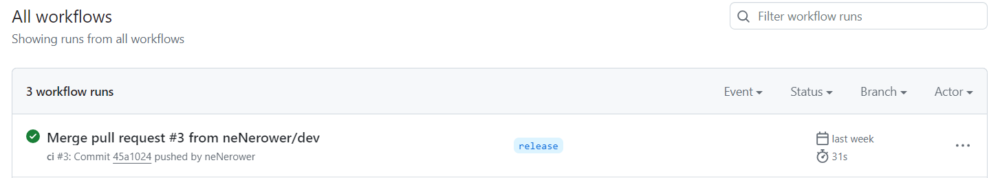
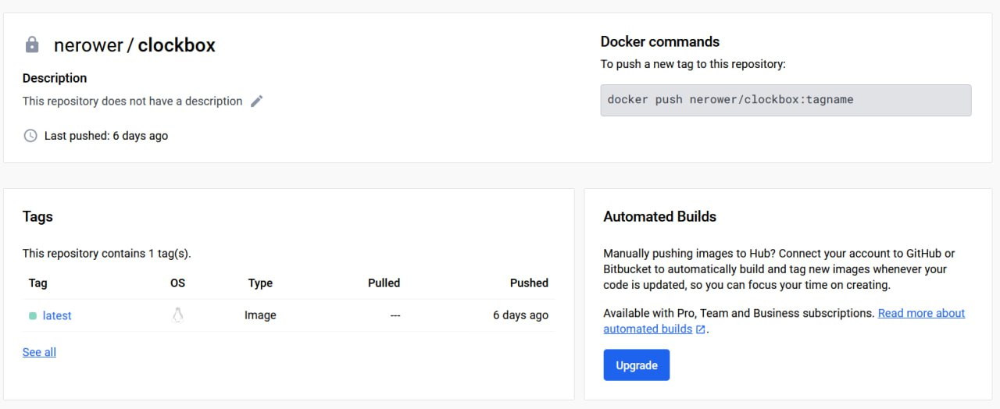

# Лабораторная работа №3

## Условие (без звездочки)

Сделать, чтобы после пуша в ваш репозиторий автоматически собирался докер образ и результат его сборки сохранялся
куда-нибудь. (например, если результат - текстовый файлик, он должен автоматически сохраниться на локальную машину, в
ваш репозиторий или на ваш сервер).

## Ход работы

1. Создали тестовый [репозиторий](https://github.com/neNerower/github_actions)
2. Добавили два секрета: Docker ID и Token для доступа к docker-hub
   
3. Добавили файл .github/workflows/main.yml, в который прописали инструкции для GitHub Actions

```yaml
name: ci

on:
  push:
    branches:
      - "release"

jobs:
  build:
    runs-on: ubuntu-latest
    steps:
      - name: Checkout
        uses: actions/checkout@v4
      - name: Login to Docker Hub
        uses: docker/login-action@v3
        with:
          username: ${{ secrets.DOCKERHUB_USERNAME }}
          password: ${{ secrets.DOCKERHUB_TOKEN }}
      - name: Set up Docker Buildx
        uses: docker/setup-buildx-action@v3
      - name: Build and push
        uses: docker/build-push-action@v5
        with:
          context: .
          file: ./Dockerfile
          push: true
          tags: ${{ secrets.DOCKERHUB_USERNAME }}/clockbox:latest
```

`on.push.branches` - указываем, что action срабатывает при пуше в заданную ветку

`runs-on` - указываем среду выполнения

`with` - передаем аргументы 

4. Проверка: при пуше в ветку release запускается workflow 

И в докер-хабе появляется образ


Mission complete!🐳
