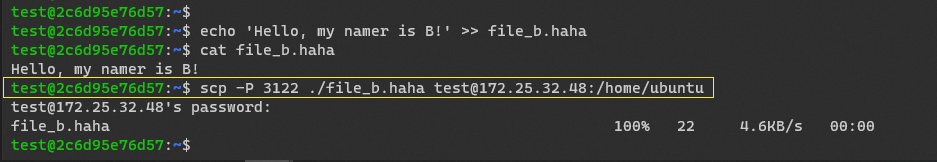
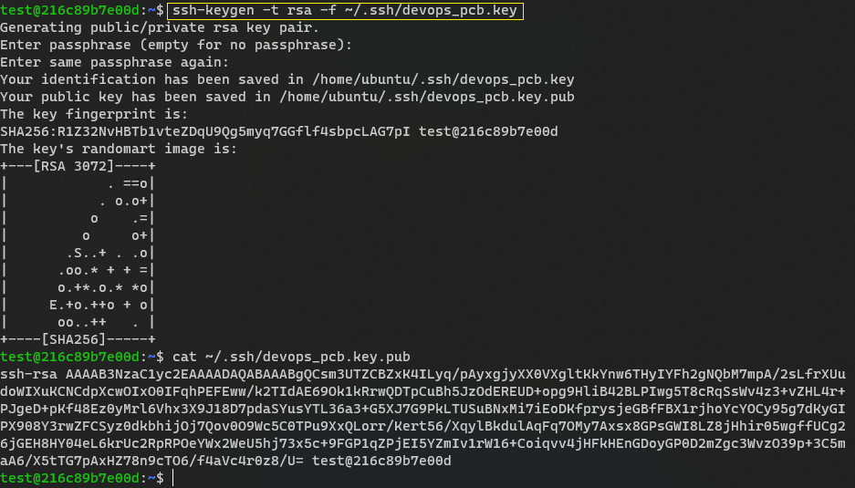

# DevOps Lab_1

## Условие (обычное)
Пользуясь терминалом на компьютере А перенести файл с компьютера Б на компьютер С, находящиеся в одной локальной сети. (Подсказка: вам понадобится ssh).

## Ход работы
1. `docker compose up -d` - разворачиваем окружение
2. `docker exec it *container_name* sh` - заходим в контейнер
3. `touch *file_name*` - создаём файл в контейнере
4. `scp *file_name* *machine_name*` - отправляем файл на *machine_1_name*
5. `ssh *machine_1_name*` - подключаемся к *machine_1_name*
6. `scp *file_name *machine_2_name*` - отправляем файл на *machine_2_name*
7. `ssh *machine_2_name*` - подключаемся к *machine_2_name*

## Скриншотики

## Условие (со звездочкой)
Сделать аналогичное, но подключаться при помощи публичных и приватных ключей, а не по логину паролю.

## Ход работы
Решили не делать лабораторную заново, а поиграться уже с получившимся вариантов. 
*что-то умное про то, как сделали, не шарю в этом*
